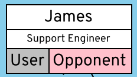

:sectnums:
:title: orgviz 
:sectanchors:
:toc:

Join the link:https://t.me/joinchat/BqSGNBqlDufb5yuvsV1Xgw[orgviz community telegram chat] for user questions, comments, or development gossip.

= orgviz 

A tool to visualize the "real" structure of organizations.

image::docs/ExampleCompany.png[]

On a technical level, this tool basically parses a high level text based language, which is compiled to the amazing GraphViz `dia` program language. It provides extra constructs and ease of use for drawing complex org charts (graphs!). 

== Installation

This tool has been tested on Fedora 30, but will almost certainly work on any
Linux with python3 and Graphviz installed. If Mac's have Graphviz, then it
should work on a Mac just fine.

If using this tool from source, the following packages are required; 

- GraphViz's `dot` - you can get this from `yum install graphviz` on most Linux distributions.
- `python3`

The following python3 libraries are also required; 

- `python3-configargparse` (note, not just `argparse`)

== Usage

To run orgviz against an input file and generate an image;

`./orgviz.py -I <inputfile>`

For more help; 

`./orgviz.py --help`

=== Getting started with the example file

Download the https://raw.githubusercontent.com/jamesread/orgviz/master/examples/ExampleCompany.org[example org file here] (right click on link, save as). Don't
copy and paste the text because it might break the tabs in the file. 

Edit the file using your favourite text editor, following this README guidance.
When you're ready, run `orgviz` like this; 

----
export ORGVIZ_INPUT=examples/ExampleCompany.org (1)
./orgviz.py (2)
xdg-open orgviz.svg (3)
----
1. Set the input file so we don't have to specify it every time
2. Run orgviz to generate the image.
3. Open the image with your default system viewer. 

NOTE: Most image viewers support "refresh", so you can edit in one text editor
window, and then "refresh" the currently open image just by pressing F5.

== Organization (Input) file syntax

----
Full Name
    supports -> Full Name
    reports -> Full Name
    influence: <enemy, supporter, promoter>
    team: Team Name
    title: Job Title
----

For the example input file that makes up the screenshot above, please see the [examples directory](examples/).

**Note**: The input file __requires__ https://www.youtube.com/watch?v=SsoOG6ZeyUI[tabs, not spaces]. It won't
parse if you indent with spaces. 

Available attributes include;

* team
* title
* country

NOTE: You can add any attribute you like, such as `phoneNumber`, or `email`, 
but attributes not listed above won't be drawn.

== Connections

Connection types can be anything - the format is `[type] -> Full Name`. Some
common types are `supports`, `reports`, `loves`, etc. 

NOTE: `supports` is the only connection type that draws a "dotted line" between
people. All other line types are straight arrows.

== Vizualisation Type (`vizType`)

When rendering the picture, there are various ways to vizualize the people. You
can choose 1 of these options (eg `--vizType none`);

1. `DS` - **Decision Making Unit** and **Sentiment** (default) 
** Uses the `dmu` and `sentiment` attributes on people. <<vizTypeDs,Go to `vizType=DS` docs>>.
2. `inf` - Influence - A simple enemy / supporter / promoter
** Uses the `influence` attribute on people. <<vizTypeInf,Go to `vizType=inf` docs>>
3. `none` - everyone is drawn with just white boxes. <<vizTypeNone,Go to `vizType=none` docs>>

=== Option 1: `DS` - Decision Making Unit and Sentiment [[vizTypeDs]] (default)

orgviz defaults to this `DS` view, which is useful for sales. `DS`
stands for **Decision Making Unit** (`dmu`) and **Sentiment** (`sentiment`). 

==== Example

==== How to use

----
James
	title: Support Engineer
	dmu: U
	sentiment: O
----

Available `dmu` options;

- **U**ser - These are the people in an organisation who actually work with the products/services and get organisational benefits from them.  In many instances they are the ones that initiate the requirement for a solution.
- **I**nfluencer - These are the people who can influence the buying decision for a number of reasons. For example, the IT team within and company may influence an organisation’s decision as to what software or solutions the company should buy. In this example, they are often the ones charged with evaluating various alternatives and making the internal recommendation to the business. If Red Hat is selected then we have achieved a Technical Win
- **G**atekeeper - These people control the flow of information to others. For example, a personal secretary may not allow the sales people from a supplier to have access to deciders or users. Likewise, a receptionist may play the role of a gatekeeper as he/she usually maintains telephone, email, and postal communications.  
- **B**uyer - These are the people who have formal authority to negotiate with suppliers. They negotiate and arrange terms of purchase with the suppliers. As negotiation is a specialist area, high level employees usually play the roles of buyers.
- **D**ecision Maker - These are the people who have the final say in the buying decision. They have the power and authority to select the final suppliers to move on with the buying process.  For example, the finance manager in a company may decide which supplier to work with on the basis of how much money the supplier is asking for a particular product/service.

Available `sentiment` options;

- **P**roponent
- **N**eutral
- **O**pponent 

=== Option 2: `inf` - Influence [[vizTypeInf]]

There is also the option to use a more simple view, called "influence" - does
this person influential or not?

==== Example

==== How to use

----
James 
	title: Support Engineer
	influence: enemy
----

Available `influence` options; 

- `enemy` - Red
- `supporter` - Blue
- `promoter` - Green
- `internal` - Black

=== Option 3: Plain display [[vizTypeNone]]

Sometimes you don't want to show the influence type when generating the
picture - this is useful for presentations and similar. 

==== Example

==== How to use

You don't need to change any attributes. Simply run orgviz like this;

----
./orgviz.py --vizType none
----

== Configuration File

If you get tired of specifying command line options, then create
`~/.orgviz.cfg` and pop your options in there to save time. You can use
`--help` to find the list of all available options.

== Profile pictures

At the moment, profile pictures just come from a directory of `.jpeg` files
that match people's names. Set the `profilePictureDirectory` option to a
directory of photos, and `profilePictures` to use this feature.

There is a separate microservice in development that auto-grabs profile
pictures and LinkedIn details, but this is not released yet.

== Credits

- Alice: https://www.pexels.com/photo/woman-wearing-blue-top-2169434/[Photo by Heitor Verdi from Pexels]
- Bob: https://www.pexels.com/photo/photography-of-a-guy-wearing-green-shirt-1222271/[Photo by Justin Shaifer from Pexels]
- Charles: https://www.pexels.com/photo/man-leaning-on-wall-2128807/[Photo from Pexels]
- Dave: https://www.pexels.com/photo/gray-scale-bearded-man-842980/[Photo by Craig McKay from Pexels]
- Fred: https://www.pexels.com/photo/man-crossed-arms-1516680/[Photo by Nitin Khajotia from Pexels]

 
