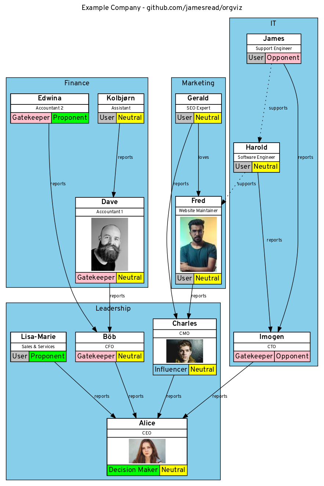

= orgviz 

:sectnums:
:title: orgviz 
:sectanchors:

A tool to visualize the "real" structure of organizations.

On a technical level, this tool basically parses a high level text based language, which is compiled to the amazing GraphViz `dia` program language. It provides extra constructs and ease of use for drawing complex org charts (graphs!). 

== Installation

This tool has been tested on Fedora 30, but will almost certainly work on any
Linux with python3 and Graphviz installed. If Mac's have Graphviz, then it
should work on a Mac just fine.

If using this tool from source, the following packages are required; 

- GraphViz's `dot`
- `python3`

The following python3 libraries are also required; 

- `python3-configargparse` (note, not just `argparse`)

== Usage

To run orgviz against an input file and generate an image;

`./orgviz.py -I <inputfile>`

For more help; 

`./orgviz.py --help`

=== Getting started with the example file

Download the https://raw.githubusercontent.com/jamesread/orgviz/master/examples/ExampleCompany.org[example org file here] (right click on link, save as). Don't
copy and paste the text because it might break the tabs in the file. 

Edit the file using your favourite text editor, following this README guidance.
When you're ready, run `orgviz` like this; 

----
export ORGVIZ_INPUT=examples/ExampleCompany.org (1)
./orgviz.py (2)
xdg-open orgviz.svg (3)
----
1. Set the input file so we don't have to specify it every time
2. Run orgviz to generate the image.
3. Open the image with your default system viewer. 

[NOTE] Most image viewers support "refresh", so you can edit in one text editor
window, and then "refresh" the currently open image just by pressing F5.

== Organization (Input) File Formal Syntax

----
Full Name
    supports -> Full Name
    reports -> Full Name
    influence: <enemy, supporter, promoter>
    team: Team Name
    title: Job Title
----

For the example input file that makes up the screenshot above, please see the [examples directory](examples/).

**Note**: The input file __requires__ https://www.youtube.com/watch?v=SsoOG6ZeyUI[tabs, not spaces]. It won't
parse if you indent with spaces. 

== Connections

Connection types can be anything - the format is `[type] -> Full Name`. Some
common types are `supports`, `reports`, `loves`, etc. 

== Influence type

=== Decision Maker and Sentiment

orgviz defaults to a "sales" view, using **Decision Maker** (`dmu`) and
**Sentiment** (`sentiment`) attributes. Here's how you might use them;

----
Alice
	title: CEO
	team: Leadership
	dmu: D
	sentiment: N
----

Available `dmu` options;

- **D**ecision Maker
- **I**nfluencer
- **G**atekeeper
- **U**ser

Available `sentiment` options;

- **P**romoter
- **N**eutral
- **O**pponent 

=== Influence 

There is also the option to use a more simple view, called "influence". For
example; 

----
Alice
	title: CEO
	team: Leadership
	influence: enemy
----

Available `influence` options; 

- `enemy` - Red
- `supporter` - Blue
- `promoter` - Green
- `internal` - Black

=== Plain display

Sometimes you don't want to show the influence type when generating the
picture - this is useful for presentations and similar. Simply run orgviz like
this;

----
./orgviz.py --vizType none
----

== Configuration File

If you get tired of specifying command line options, then create
`~/.orgviz.cfg` and pop your options in there to save time. You can use
`--help` to find the list of all available options.

== Profile pictures

At the moment, profile pictures just come from a directory of `.jpeg` files
that match people's names. Set the `profilePictureDirectory` option to a
directory of photos, and `profilePictures` to use this feature.

There is a separate microservice in development that auto-grabs profile
pictures and LinkedIn details, but this is not released yet.

== Credits

- Alice: Photo by Heitor Verdi from Pexels https://www.pexels.com/photo/woman-wearing-blue-top-2169434/
- Bob: Photo by Justin Shaifer from Pexels https://www.pexels.com/photo/photography-of-a-guy-wearing-green-shirt-1222271/
- Charles: https://www.pexels.com/photo/man-leaning-on-wall-2128807/
- Dave: Photo by Craig McKay from Pexels https://www.pexels.com/photo/gray-scale-bearded-man-842980/
- Fred: Photo by Nitin Khajotia from Pexels https://www.pexels.com/photo/man-crossed-arms-1516680/
 
